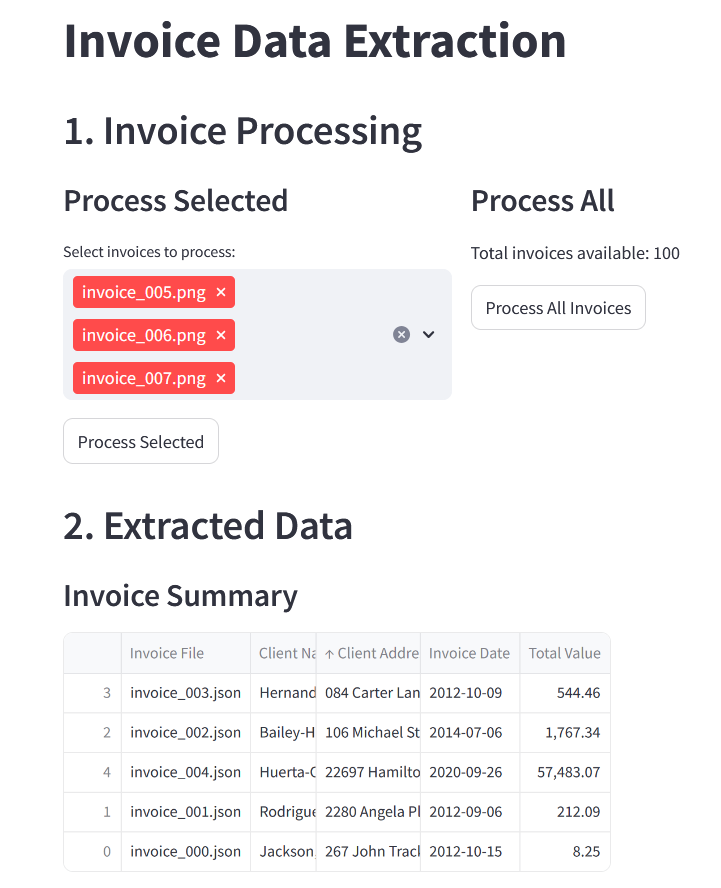
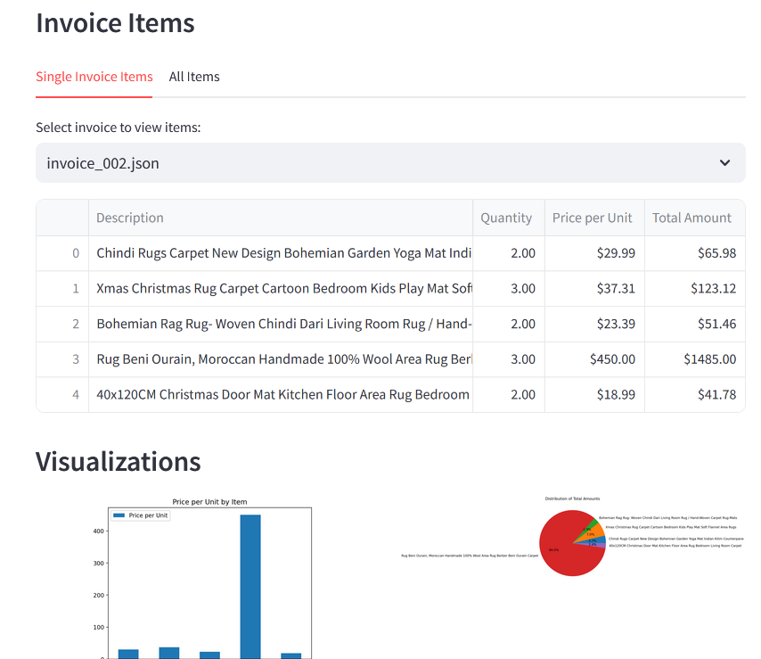
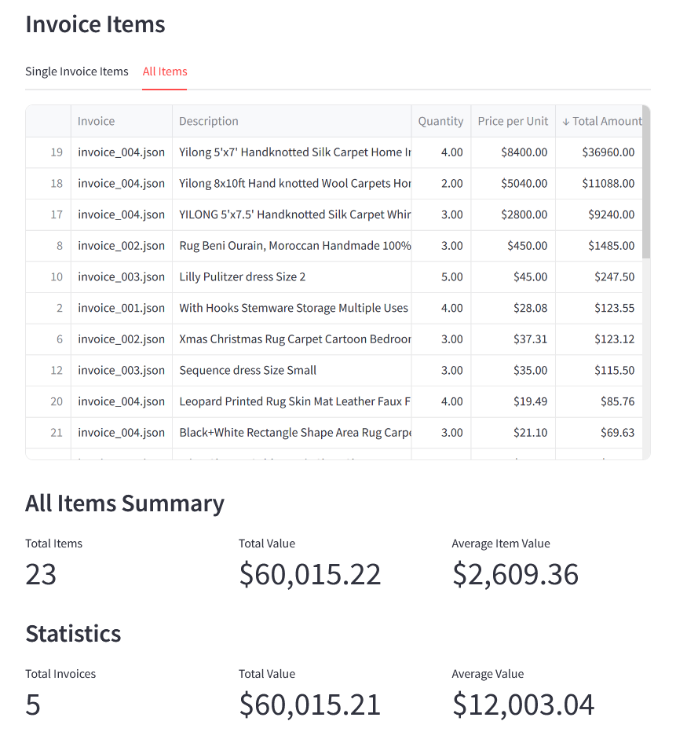

Here’s a draft structure for your blog post with some additional points to enhance the story:

---

### Why I Stopped Using Jupyter Notebook and What Comes Instead

#### The Pain Points of Jupyter Notebooks
Let’s face it: Jupyter Notebooks were revolutionary, but they come with some undeniable frustrations. Here are the reasons I reached my breaking point:

1. **Messy Processes**: Notebook interfaces seem neat initially, but they often lead to scattered code blocks and endless scrolling. Navigating between cells and finding the right chunk of code quickly becomes chaotic.
  
2. **Reload Hassles**: Making updates or reloading data means rerunning cells from the start, creating a highly error-prone environment. How many times have I missed a step or run into dependencies issues because cells were executed out of order?

3. **Click, Click, Click**: Notebooks force you into a “click culture.” Each function, each step in an experiment, means executing cells manually, one at a time. It’s like building a car but needing to start the engine separately for each component.

4. **Poor Structure**: Jupyter Notebooks don’t naturally encourage structured code. Functions, logic, and outputs all mix together in one place, making it difficult to organize or maintain complex workflows.

5. **Not Scalable**: As projects grow, Notebooks struggle to scale. They lack the robustness and flexibility to adapt to larger, production-level demands, especially when dealing with intricate data pipelines or output requirements.

---

#### Transitioning to an AI-Assisted Process

Instead of struggling with endless cells and clicks, I now use **AI to rapidly design custom tools** that suit my workflows. Here’s how it works:

1. **Defining the Experiment**: I outline the main functions I need, such as a data extraction pipeline, quality testing, or evaluation processes.

2. **AI-Assisted App Development**: I use AI to quickly generate a functional Streamlit app based on this structure. Within minutes, AI produces a simple yet effective app interface where I can run and check my workflows.

3. **Using the App for Analysis**: The app is then my go-to environment for presenting and evaluating results. I can load data, adjust inputs, and visualize outcomes in a more interactive and engaging way.

- **Centralized Logic and Presentation**: The app brings all essential components – data sources, pipeline logic, and output display – into a single, clean interface. And refreshing the code? Just one click.

---

#### Key Benefits

By letting AI assist in building a functional app for my experiments and tests, I’ve experienced so far: 

1. **Time-Saving**: Setup is faster and simpler, freeing up more time to focus on the analysis itself.

2. **Effortless Organization**: Structured code keeps everything in one place, avoiding the chaos of disconnected cells and scattered logic.

3. **Enhanced Data Presentation**: The interactive interface allows me to present data more dynamically, with better visualization and organization – no more raw JSON dumps or endless dataframe printouts.

4. **Improved Insights**: Data is searchable, sortable, and filterable by default, making it easy to focus on specific details.

5. **High-Quality Output**: The final product is polished and far more accessible than a typical Notebook, which is particularly useful when sharing results.

6. **Visual Representation**: Built-in graphical representations allow for instant comparison between different experiment outcomes.

7. **More Enjoyable Evaluation**: Evaluating data within a customized app feels interactive and engaging, transforming the process into a pleasure rather than a chore.

---

#### A Better Process for Any Data-Centric Task

This process of **using AI to generate tailored apps** feels like a breakthrough for anyone working with data. It’s not just a replacement for Notebooks but also a flexible alternative to Excel, allowing for dynamic, interactive tools that serve specific internal workflows or tasks.
Not only do I, as a developer, benefit from this streamlined process, but my clients also gain enhanced visibility and interaction with their newly acquired data, results, and insights, empowering them to explore and make informed decisions confidently.

showing selection of invoices to process and process options

showing invoice items extracted from an invoice image

showing table of all extracted data and sorted by total amount

