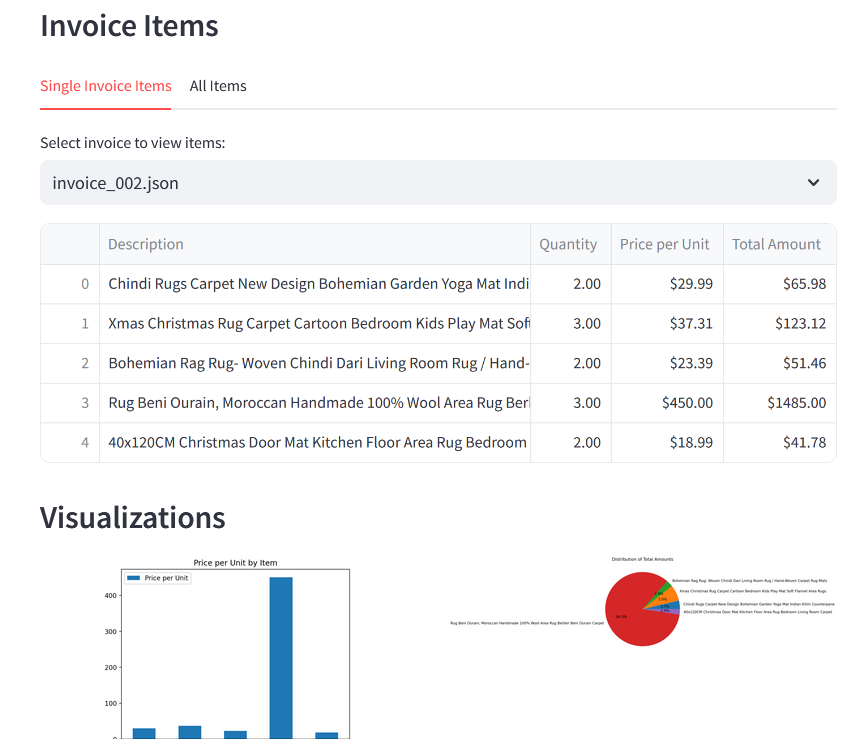

# Breaking Up with Jupyter Notebooks: How AI-Powered Apps Revitalized My Workflow

_So, Jupyter Notebooks. We had some good times, didn't we?_

---

Writing code and seeing the results instantly felt great. But over time, the quirks I once found charming became... less so. Navigating between cells to find code? Frustrating. Forget to run a cell, and dependencies laugh in your face. And the workflow.. Each function, each step in an experiment, means executing cells manually, one at a time. It felt like trying to bake a cake but having to preheat the oven separately for every ingredient. Functions, logic, and outputs all mix together in one place, making complex workflows hard to manage.

Admittedly, could be I am just not good at using them.

Then once I told my coding AI assitant: "Could you develop a tool to present my results in a more interactive way?
In her usual friendly manner, she replied: "Certainly ...".

---

That's how I discovered **AI-assisted app development**.

---

Now, I outline what I need, and AI helps me create a functional app using just natural language. In minutes, I have an interface to run and check my workflows.  It's like having a sous-chef who preps all the ingredients while I sit back and sip coffee. ( I really do!)

Here's an illustrative example using Hugging Face's dataset:
 (mychen76/invoices-and-receipts_ocr_v1) 
This UI allows me to configure my processing pipeline, select one or several documents to be processed and then results are displayed in a table.

Everything I need is in one place. Data sources, pipeline logic, output displays. Refreshing code is just one click away. Searching through test results, sorting, filtering, visualizing—the imagination is the only limit.

My data is presented dynamically. No more raw JSON dumps. Now, I have visuals that make insights accessible. It's interactive, engaging, and - dare I say - fun.

---

I've always been a backend developer, never really cared about frontend. Making this shift has been like "oh, I can do that? Am I in the developer's paradise?" What I like: time savings with every phase, setup, development and testings. I spend less time and attention fiddling with the environment and have more resources to dive into the analysis. It's like having extra hours magically added to my day. No more disconnected cells or scattered logic. 

The app is then my go-to environment for presenting and evaluating results. Built-in graphical representations and tables allow for comfy comparison between different experiment outcomes and all the tedious evaluation work feels less like "Let's slog through this" and more like "Let's see what we find here".

---

 It's actually more than a Notebook replacement. For me, as a developer, this script-to-app workflow has revolutionized my data projects. And it's not just about me. My clients now enjoy enhanced interaction with their data, exploring and making informed decisions. It's empowering, and it's exciting.

