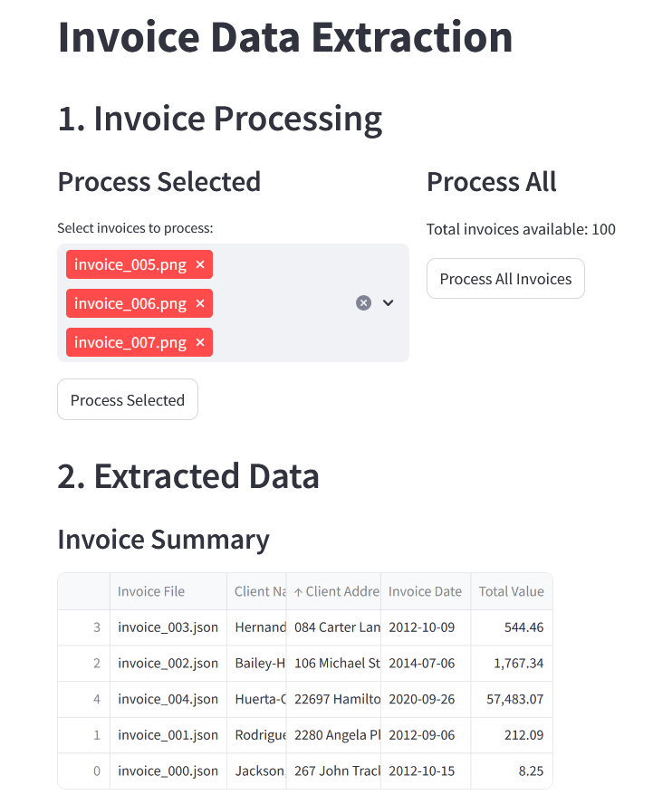
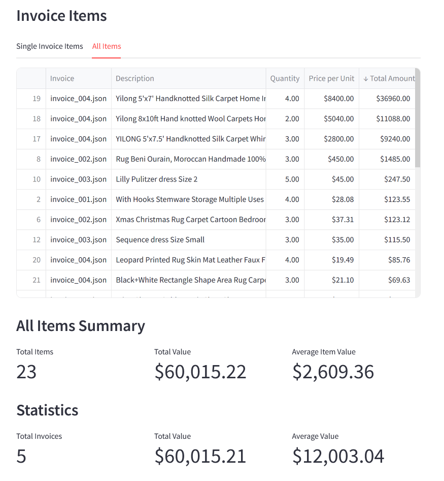

# Breaking Up with Jupyter Notebooks: How AI-Powered Apps Revitalized My Workflow

*So, Jupyter Notebooks. We had some good times, didn't we?*

---

Writing code and seeing results instantly was great. But over time, the quirks became less charming. Navigating between cells to find code? Frustrating. Forget to run a cell, and dependencies break. Notebooks force you into a "click culture," manually executing cells one at a time. It felt like trying to bake a cake but having to preheat the oven separately for every ingredient. Functions, logic, and outputs all mixed together, making complex workflows hard to manage.

Maybe I'm just not adept at using them.

So I asked my coding AI assistant, "Could you develop a tool to present my results more interactively?" He replied, "Certainly. Let's use the Streamlit library."

---

That's how I discovered **AI-assisted app development**.

---

Now, I outline what I need, and AI helps me create a functional app using just natural language. In minutes, I have an interface to run and check my workflows. It's like having a sous-chef while I sip coffee.

Here's an illustrative example using Hugging Face's dataset:

Everything is in one place—data sources, pipeline logic, outputs. Refreshing code is one click away. Searching, sorting, filtering, visualizing—it's all possible.

The interactive interface lets me present data dynamically. No more raw JSON dumps. Now, I have visuals that make insights accessible. It's engaging and fun.

---

As a backend developer, this shift was eye-opening. Time saved at every phase means more focus on analysis. The app has become my hub for presenting and evaluating results. Comparing different outcomes is easy, and evaluation feels exciting.

---

Using AI to create tailored apps revolutionized my data projects. It's more than a Notebook replacement—it's transformative. My clients now enjoy enhanced interaction with their data, empowering informed decisions. It's exciting for everyone involved.

---

