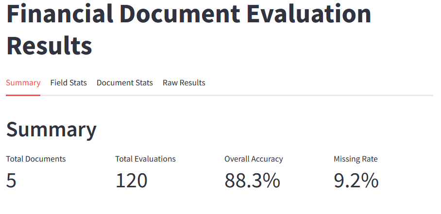
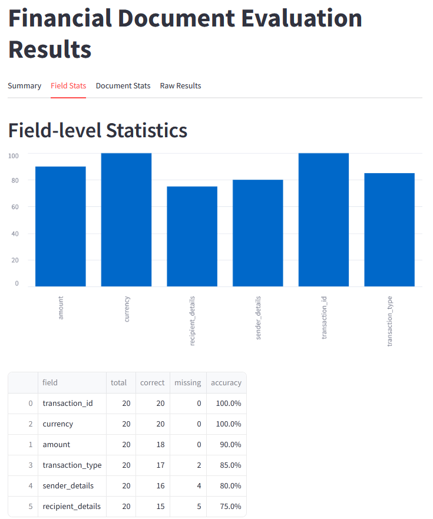
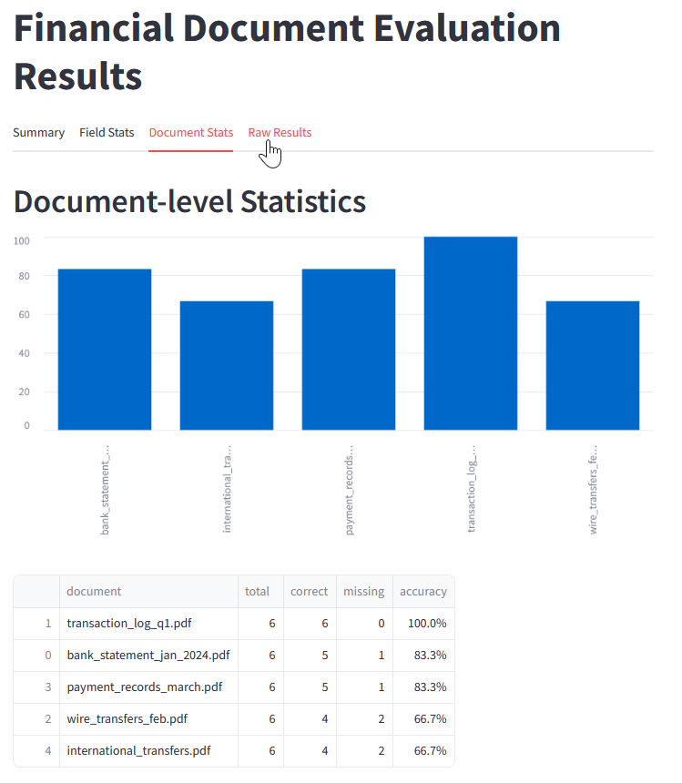
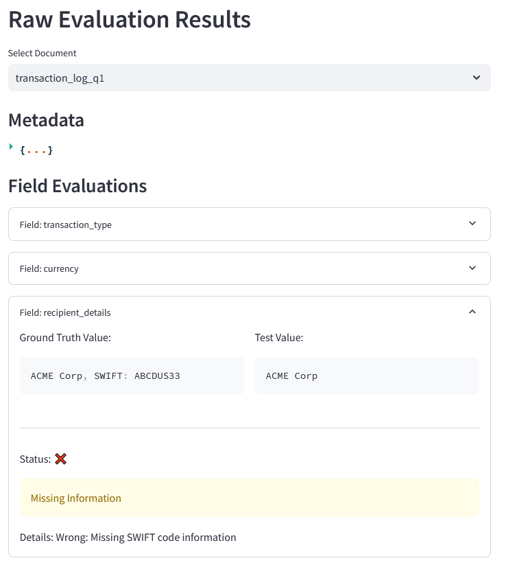

## **Evaluation Solution Overview**

Modern organizations rely on data collection, processing and aggregation to capture information from documents, websites, processes or databases. But how can you ensure the extracted data is accurate and complete? Our **Evaluation Solution** compares your extracted data to a “ground truth”—the verified or human-annotated source of truth—and provides clear, actionable insights.

Prefer: Modern businesses often collect or extract information from various sources—documents, web content, databases, and more. Ensuring the **accuracy** of these extracted data points is crucial. Our **Evaluation Solution** automatically checks how well collected information matches an established **ground truth** (i.e., the “correct” data), providing insights and confidence in the data’s consistency and reliability.

### **Key Benefits**

1. **Confidence in Data Quality**  
   Instantly see how many fields match the ground truth across your entire dataset, so you know whether your data pipeline is reliable.

2. **Time & Cost Savings**  
   Automate detailed checks that would otherwise require painstaking manual reviews.

3. **Transparency & Detail**  
   Field-level statistics pinpoint which data points (e.g., “Company Name,” “Job Title,” “Diagnosis Code”) are correct, missing, or incorrect—facilitating focused improvements.

4. **Scalable & Flexible**  
   Evaluate data across hundreds or thousands of documents at once, adapting to various data structures and industries (finance, HR, healthcare, etc.).

5. **No Strict Format Required**  
   - **Ground truth data** doesn’t need to share the exact format or field names as your extracted data. Our system **automatically normalizes** your input, handling mismatches gracefully.  
   - **Lacking ground truth data?** We provide **automated or semi-automated** methods to help you create a suitable reference, so you can still validate your extracted data effectively.

other form:
### **Key Benefits**

- **Quality Assurance**: Quickly identify where extracted data is missing or incorrect.
- **Efficiency**: Automate field-by-field checks, eliminating time-consuming manual reviews.
- **Flexibility**: Adapt to different business needs, data structures, and content types.
- **Transparency**: Offer detailed comparison and error reporting, making it easy to see where improvements are needed.

### **Who Can Use It?**

- **Financial Institutions**: Validate extracted data in due diligence or risk assessments.  
- **Legal Teams**: Check compliance documents or contracts for missing clauses.  
- **Marketing & Sales**: Ensure correct metadata in large product catalogs.  
- **Healthcare**: Compare patient records or insurance forms against official data.

Wherever data accuracy matters, our solution provides a robust, automated way to measure and improve it.

## **How It Works**

1. **Data Gathering**  
   - Gather your extracted data (e.g., from AI scrapers, OCR systems, or third-party tools).  
   - Prepare or generate the “Ground Truth” (verified data). Our solution will normalize and align these datasets, even if they differ in structure or naming.

2. **Automated Comparison**  
   - Using our **GroundTruthEvaluator**, each data field from the extracted dataset is compared to the corresponding ground truth field.  
   - **Semantic Matching** ensures minor naming or formatting differences don’t lead to false negatives.

3. **Aggregation & Reporting**  
   - Results from multiple documents are aggregated to produce comprehensive metrics: **Total Fields**, **Fields Correct**, **Fields Missing**, and **Overall Accuracy**.  
   - An interactive dashboard (or any BI/reporting tool you prefer) displays these metrics by **document** or **field**, offering clear visuals.

4. **Continuous Improvement**  
   - Insights guide refinements for your extraction pipelines—helping you fine-tune algorithms or data-entry workflows.  
   - As you make changes, re-run the evaluation to measure and track improvements over time.

---

## **Putting It All Together**

- **Broad Applicability**: The same evaluation pipeline works for **finance, HR, healthcare**, and more.  
- **Actionable Insights**: Quickly identify whether an extraction run yields sufficient accuracy, and if not, where it’s failing.  
- **No Strict Format Requirements**: The system **normalizes** different data formats and field names so you don’t have to align them manually.  
- **Ground Truth Creation**: Even if you lack ground truth data, we offer **automated** or **semi-automated** means to generate it, ensuring that consistent validation is always possible.


### **System Flow Visualization**

```
        ┌───────────────┐
        │ Extracted Data│
        └───────────────┘
                 │
                 ▼
        ┌─────────────────────────────┐
        │ GroundTruthEvaluator        │
        │ - Field-by-field checks     │
        │ - Semantic comparisons      │
        │ - Missing info detection    │
        └─────────────────────────────┘
                 │
                 ▼
        ┌─────────────────────────────┐
        │ Aggregator / Result Manager │
        │ - Collects evaluation runs  │
        │ - Summarizes correctness    │
        │ - Tracks error categories   │
        └─────────────────────────────┘
                 │
                 ▼
        ┌─────────────────────────────┐
        │ Visualization Dashboard     │
        │ - Charts, tables, metrics   │
        │ - Detailed error reporting  │
        └─────────────────────────────┘
```


---

**3. Example Dashboard Views: Three Synthetic Use Cases**

Below, we provide three illustrative use cases, each with synthetic data demonstrating **document-level** and **field-level** metrics. These examples highlight how the dashboard might present its summaries and deeper insights.  

> **Note:** The numbers may not perfectly add up (e.g., correct vs. missing might not sum to “total” in a perfectly literal sense) but serve as illustrative placeholders.

---






---

**How These Results Are Used**

1. **Immediate Quality Insights**: Analysts see at a glance whether a particular extraction run is reliable enough.  
2. **Root Cause Analysis**: Identify which fields or document types are consistently problematic.  
3. **Continuous Improvement**: Guide fine-tuning of extraction models or data-entry processes.  

---

### **Putting It All Together**

- **Consistent Structure**: Each CSV uses the same format, ensuring that the data can be aggregated, visualized, and interpreted easily.  
- **Flexible & Scalable**: Whether you have 10 or 10,000 documents, the evaluation pipeline can handle it.  
- **Customizable**: The approach supports different business contexts, from financial to healthcare to retail, thanks to a **modular design** (BaseEvaluator and specialized evaluators).

